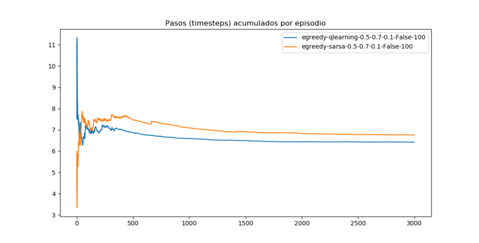
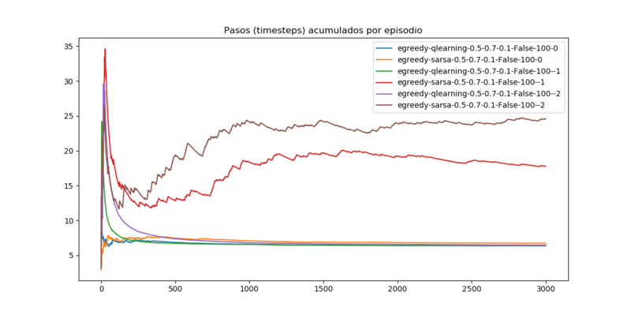
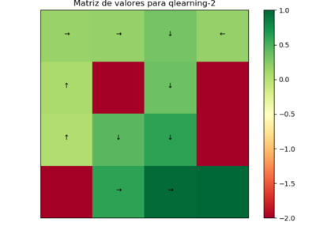

# Laboratorio 1: Frozen Lake

> **Aprendizaje por Refuerzos** - *Diplomatura en Ciencias de Datos, Aprendizaje Automático 
y sus aplicaciones.*

> Gonzalo Zigarán

A partir del entorno `FrozenLake` de la librería `OpenAIGym`, se implementa un agente para 
evaluar las diferentes variantes a la hora de implementar algoritmos para aprendizaje por 
refuerzos. Las diferentes variantes a analizar van a ser:  
1. Elección de política, epsilon-greedy y softmax
1. Diferentes algortmos de aprendizaje, Q-Learning (off-policy) y SARSA (on-policy)
1. Variantes en Slippery, para decidir si las acciones van a ser determinísticas o no
1. Variantes en la penalización al caer al agua
1. Diferente cantidad de pasos posibles en el entorno

### Variación de Política

La política epsilon-greedy en cada estado va a decidir tomar una acción aleatorea con 
probabilidad epsilon y va a decidir tomar la acción óptima con probabilidad 1-epsilon. 
Mientras que la política Softmax, va a a tomar una acción aleatorea pero cada acción pesada 
de acuerdo a su valor.

El hiper-parmámetro de la política epsilon-greedy es epsilon, y de softmax es tau, que indica 
cuanto se van a ponderar los valores. Además vamos a explorar los valores de alpha y gamma, 
propios del algoritmo de aprendizaje.

##### Variación de alpha

El hiper-parámetro alpha indica cuanto se va a actualizar el valor de Q en el cambio temporal, 
es decir que un valor grande de alpha, modifica mucho el valor de Q en cada paso. Comenzamos 
dejando fijo los demás hiper-parametros y modificamos alpha en los valores 0.1, 0.3, 0.5, 0.7 
 y 0.9 utilizando la política epsilon-greedy

    alpha = [0.1, 0.3, 0.5, 0.7, 0.9]
    gamma = 0.9
    epsilon = 0.1

Se puede ver como con un alpha grande el algoritmo converge más rápido al reward. Con 0.1 y 
0.3 se obtienen resultados bastantes inferiores a los otros valores. Mientras que 0.5, 0.7 y 
0.9 no tienen grandes diferencias.

La cantidad de pasos por episodios parece comportarse de manera muy similar para las variantes
 de alpha.

Al no observar una mejora significativa con un alpha de 0.7 o 0.9, se decide seguir trabajando 
con alpha = 0.5

##### Variación de gamma

El valor de gamma indica cuanto se va a pesar el valor de Q para las acciones del estado 
siguiente a la hora de actualizar el valor de Q en el estado actual. Vamos a explorar los 
siguientes valores:

    alpha = 0.5
    gamma = [0.1, 0.3, 0.5, 0.7, 0.9]
    epsilon = 0.1

En ambos gráficos se observa que el valor de 0.7 para gamma logra una convergencia más veloz 
que los otros valores, por lo que se va a seguir trabajando con este valor.

#### Epsilon-greedy
##### Variación de epsilon

Este hiper-parámetro fija en que medida se va a explorar, un valor grande de epsilon implica 
que va a haber mucha exploración. Se van a analizar los siguientes valores:

    alpha = 0.5
    gamma = 0.7
    epsilon = [0.1, 0.3, 0.5, 0.7, 0.9]
   

Para esta política se puede ver claramente como afecta el cambio de valor de epsilon. Para 
valores pequeños de epsilon (lo que implica mucha explotación) se logran valores mayores de 
recompensa en muchas pasos de iteración, convergiendo a valores óptimos. Para los valores 
grandes de epsilon (mucha exploración) se observa lo contrario, converge rápidamente a un 
valor muy inferior. Es por eso que en los primeros pasos el algoritmo avanza muy rápido, 
pero luego se estanca. 

También se observa que la cantidad de pasos por episodios a lo que converge el algoritmo 
con un epsilon chico es menor.

#### Softmax
##### Variación de tau

La política Softmax elige una acción al azar, pero cada acción se pondera de acuerdo al valor 
que se obtiene. El valor de tau pesa esa ponderación, valores grandes de tau implica ponderar 
poco mientras que valores muy chicos de tau conlleva a darle mucha importancia a las acciones 
óptimas. Un valor muy grande de tau lleva a que las acciones sean equiprobables (comparable a 
que el epsilon sea muy grande en la política epsilon-greedy). Se va a explorar en los 
siguientes valores:

    alpha = 0.5
    gamma = 0.7
    tau = [0.1, 0.5, 1, 25]

Para el único valor de tau que se observa convergencia es para 0.1, es decir cuando
se busca explotar la acción óptima. Para los valores mayores a 0.5, esta política nunca deja 
de explorar, por lo que no converge.

En la cantidad de pasos por episodio no se ven grandes diferencias, todos convergen a 
aproximadamente 8 pasos por episodios (que analizando el entorno no es lo óptimo)

#### Epsilon-greedy vs Softmax

Ahora vamos a comparar las 2 políticas con el parámetro óptimo que encontramos para cada una 
es decir:

    alpha = 0.5
    gamma = 0.7
    epsilon = 0.1
    tau = 0.1

En este gráfico se puede ver cómo estas 2 políticas con su parámetro óptimo logran niveles 
de convergencia similares para la recompensa. Si bien a la política epsilon-greedy le cuesta 
más episodios empezar a aumentar la recompensa (probablemente porque inicialmente le está 
dando más importancia a acciones que no son óptimas), rápidamente se emparejan las 2 políticas 
y convergen a un valor de 0.8

En este grático sí se observa una diferencia. Si bien las 2 políticas convergían a un valor 
similar de recompensa, la política epsilon-greedy converge a 6 pasos por episodio (analizando 
el entorno, es lo óptimo), mientras que la política softmax converge a más de 8 pasos por 
episodio. Por lo que se puede concluir que con la política epsilon-greedy se lograron mejores
valores.

### Variación de algorítmo de aprendizaje
#### Q-learning vs SARSA

Se va a analizar ahora la diferencia entre un algoritmo Off-policy y uno On-policy. Se 
espera que el algoritmo Q-learning (Off-policy) llegue a la matriz de valores que devuelva 
en cada estado el valor de seguir la política óptima. Mientras que de SARSA (On-policy)  se 
espera que ajuste a la política que se está tomando, por lo que se vería mucho más 
influenciado por la política en la simulación, ajustando esos valores en la matriz.

##### Convergencia

En la convergencia vemos que ambos algoritmos se comportan de manera similar, Q-learning 
converge más rápido pero sin grandes ventajas.

##### Matriz de valores

 

Este entorno no parece el adecuado para analizar esta diferencia pero si se logra rescatar 
algo. Si bien ambos algoritmos encontraron el mismo camino óptimo, la matriz de Q-learning 
está bastante simétrica en cuando a los 2 caminos óptimos que tiene el entorno, mientras 
que SARSA parece premiar mucho más el camino que encontró sobre el otro que también es 
óptimo.

### Slippery

Hasta ahora estabamos asumiendo que las acciones son determinísticas, es decir que si la 
política decidió moverse para abajo, entonces el agente se movía para abajo. Con la opción 
de `slippery` lo que se setea es que ese movimiento no sea determinístico. 

Ambos algoritmos logran una recompensa promedio por episodio muy baja, rondando el 0.1 cuando 
con el problema de manera determinística llegaba a 0.8 de recompensa por episodio. 

Como consecuencia de lo anterior, con la opción `slippery` activada, el algoritmo termina 
realizando más pasos por episodio, convergiendo en aproximadamente 11 pasos, mientras que de 
la manera determinística convergía entre 6 y 7 pasos por episodio. 

##### Matriz de valores

 

La matriz de valores explica lo que observabamos antes, el algoritmo no logra propagar la 
recompensa para los estados lejanos del goal, además de que no encuentra las acciones 
óptimas para ningún estado debido a la aleatoriedad. 

### Diferente Penalidad

Por como está modelado el entorno, cada episodio finaliza cuando llega al goal, o cae en un 
pozo. En el primer caso se obtiene una recompensa de 1 (si llega al objetivo) y en el segundo
se obtiene una recompensa de 0 (no se llega al objetivo).

Esos valores de recompensa son una forma de modelar el problema, pero se puede modelar de muchas
maneras distintas, siempre con el objetivo de resolver el mismo problema. En esa sección 
vamos a cambiar este modelado, penalizando con una recompensa negativa cuando el agente cae 
en un pozo. Vamos a penalizar con -1 y con -2 y compararlo con el modelo que no penaliza. 

Con este modelo vamos a utilizar los 2 algoritmos (Q-learning y SARSA) y ver como afecta a cada 
uno.

La primera observación importante es que al considerar penalidad por caer al pozo, los 2 
algoritmos escalan más rápido en la recompensa promedio. Probablemente porque como ambos 
algoritmos inician todos los estados con 0, le lleva varios episodios al agente diferenciar 
un estado común de un pozo, en cambio al penalizar (con -1 o -2), desde un comienzo el agente 
ya puede distinguir entre un pozo y un estado común. 

La otra observación que se puede hacer es sobre el algoritmo SARSA que si bien comienza muy 
bien para los primeros episodios cuando se penalizan los pozos, al correr el tiempo la recompensa 
promedio decae, y esto se puede deber a que es un algoritmo On-policy y encuentra la recompensa 
promedio para esa política y no para la política óptima. En la política óptima, al ser un 
problema determinístico, no se espera que el agente caiga en un pozo, mientras que para la 
política epsilon-greedy esto si puede suceder. 

La segunda observación también se ve reflejada en este gráfico, mientras que Q-learning llega a 
la misma cantidad de pasos por episodio con la penalidad, SARSA ya no logra esto, sino que recorre 
varios pasos más por episodio. 

#### Penalidad con Q-learning

Como vimos que para SARSA la curva de aprendizaje empeoraba con respecto a lo que habíamos 
obtenido antes, vamos a trabajar sólo con Q-learning para analizarlo en detalle.

Se puede resaltar que para los 2 cosas de penalización considerados, el algoritmo Q-learning 
converge rápidamente, estabilizandose en 500 episodios. Mientras que en esa cantidad de 
episodios el problema sin penalización todavía no había empezado a actualizar la recompensa 
prácticamente. Esto probablemente esté relacionado con que desde el modelo ya se está indicando 
una diferencia entre el estado con hielo y el estado con pozo. 

Una cosa a destacar también es que para la penalización con -2, el promedio de la recompensa 
acumulada, converge a un valor ligeramente inferior. Esto puede deberse a las recompensas 
negativas que obtiene en los primeros episodios.

En la cantidad de pasos, las 3 variantes parecen comportarse de manera muy similar, convergiendo 
a lo mismo en la misma velocidad. 

##### Matriz de valores

 

Observando la matriz de valores para los casos con penalización, se puede ver que para la matriz 
con penalización -1, el agente nunca recorrió el estado (0,3), que por cómo es el entorno es el 
único estado que nunca conviene recorrer en una política óptima. Mientras que para la matriz del 
-2, el agente parece haber encontrado un camino óptimo y reforzó ese camino en los demás episodios.

### Variantes en cantidad de pasos

Hasta el momento le estabamos permitiendo al agente realizar hasta 100 pasos en cada episodio (
si es que no finaliza antes). Para el problema que se aborda este numero parece ser muy grande, 
ya que el camino óptimo es de 6 pasos. Si bien esto permite que el agente pueda explorar mucho 
para encontrar políticas óptimas esto parece ser contra producente. En esta parte se va a explorar 
posibles cantidades máximas de pasos para el agente y ver como repercute.

La convergencia parece mejorar mucho al considerar un número máximo de pasos por episodio menor. 
Cuando se pone como máximo 10 o 25 pasos, el algoritmo converge y se estabiliza antes de los 500 
episodios, y además logra una recompensa por episodio mayor. Esto puede deberse a que no se le 
permite al agente explorar muchas veces por episodio, que en este entorno sería negativo, 
prácticamente como caer en un pozo y comenzar de nuevo. Por eso se acelera el tiempo de 
convergencia. 

Otra observación que se destaca es la similitud entre las cantidades de 500 y de 100. Lo que 
hace intuir que es prácticamente imposible que llegue a realizar 100 pasos en un episodio y que 
ambos valores lo que están permitiendo es que el agente finalice el episodio en el objetivo o 
en un pozo. 

Esta velocidad de convergencia también se observa en la cantidad de pasos promedio por episodio. 

##### Matriz de valores

En las matrices de valores no se observan grandes diferencias hasta observar el caso de 
la matriz para la cantidad máxima de pasos de 10.

En este caso algo que se destaca es que no llega a recorrer el estado (0,3). Esto puede deberse 
a que es muy dificil lograr propagar el valor del goal hasta ahí, ya que para llegar a 
propagarlo los demás estados ya tienen un valor mayor a 0 y con la cantidad de pasos tan 
limitada es muy dificil que llegue a explorar ese valor de nuevo. 