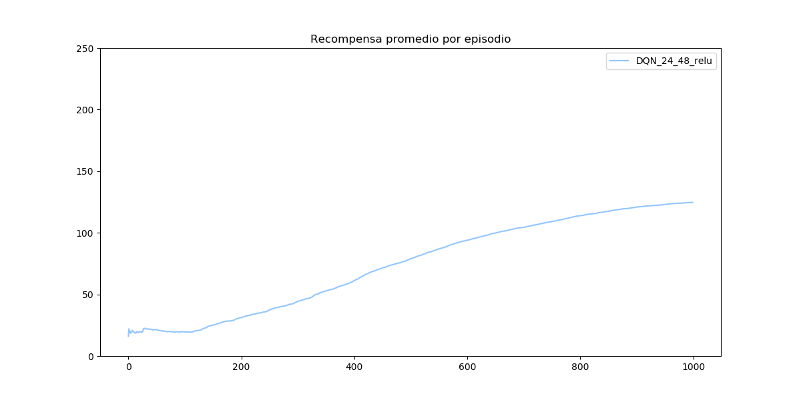

# Laboratorio 2: CartPole y MountainCar

> **Aprendizaje por Refuerzos** - *Diplomatura en Ciencias de Datos, 
Aprendizaje Automático y sus aplicaciones.*

> Gonzalo Zigarán

El objetivo general del laboratorio es ejecutar agentes de aprendizaje por 
refuerzo aproximando la función de valor por con algún modelo (o a través de 
una función lineal o con una red neuronal). Se van a probar en 2 entornos, 
`CartPole` y `MountainCar`

## CartPole

### Aproximación con Redes Neuronales

A partir de la configuración de de la Red Neuronal planteada en la presentación
del laboratorio, se va a explorar modificando diferentes parametros para 
mejorar la performance. En orden, se van a modificar los siguientes parámetros:
1. Cantidad de capas ocultas de la red
1. Cantidad de nueronas por capa
1. La función de activación de las neuronas

Para el caso *base*, se utilizan 2 capas ocultas, con 24 y 48 neuronas 
respectivamente, y función de activación `ReLU` en ambas. Obteniendo el 
siguiente gráfico de recompensa media por episodio:

#### Variación en cantidad de capas ocultas

En la primer prueba, lo que se va a analizar es la cantidad de capas ocultas 
que se utilizan en la red. Para el experimentos se van a probar 4 
configuraciones, con 1, 2, 3 o 4 capas ocultas. En todos los casos cada capa 
va a tener 20 neuronas y en todas la función de activación a utilizar el la 
función `ReLU`.

Se puede observar que de 1 a 2 capas oculatas hay una variación significativa 
de la performance, y de 2 a 3 capas también. Al introducir una cuarta capa 
oculta la recompensa promedio disminuye con respecto a las 3 capas ocultas. 
Por lo que se decide utilizar 3 capaz ocultas en los próximos experimentos.

#### Variación en cantidad de neuronas por capa

Como segundo experimento se plantea variar la cantidad de neuronas que tiene 
cada capa oculta. Con la cantidad de 3 capas ocultas obtenidas del paso 
anterior, se eligen 4 configuraciones de neuronas por capa como se detallan a
continuación:

    1 - [20, 20, 20]
    2 - [20, 40, 20]
    3 - [40, 80, 40]
    4 - [40, 20, 40]

Este parámetro no parece ser muy determinante para el resultado. En todas las
configuraciones se observan resultados similares. Por lo que podemos concluir 
que este parámetro no significativo para este problema. Para los siguientes 
experimentos se utilizará la configuración [40, 20, 40], que es la que mayor 
recompensa promedio por episodio obtuvo.

#### Variación en función de activación

Por último se decide alternar la función de activación de cada capa oculta. 
Hasta este momento se trabajó siempre con la función de activación 
[`ReLU`](https://keras.io/activations/#relu), en esta etapa vamos a probar con
otras 2 funciones: [`TanH`](https://keras.io/activations/#tanh) y 
[`softsign`](https://keras.io/activations/#softsign). Con estas 3 funciones,
experimentamos con las siguientes 4 configuraciones:

    1 - [relu, relu, relu]
    2 - [tanh, tanh, tanh]
    3 - [softsign, softsign, softsign]
    4 - [relu, tanh, softsign]

Con estas curvas de recompensa promedio queda claro que la función de 
activación que mejor funciona en este problema es la función `ReLU`, quedando 
muy por encima de las otras configuraciones. Algo llamativo es que la opción 
que combinaba las 3 funciones, obtiene peor performance que cada una por 
separado. 

Con estos 3 análisis podemos concluir que la mejor configuración posible para 
las variantes evaluadas es una red neuronal con 3 capas ocultas de 20, 40 y 20 
neuronas respectivamente, y con función de activación `ReLU` para todas las 
capas. Con esta configuración se obtiene una recompensa promedio de al rededor
de 170.

## MountainCar

En este nuevo entorno, el agente es un auto que está entre 2 montañas y el 
objetivo es que llegue a la cima de una de las 2. Como no puede impulsarse 
para llegar a la cima en un movimiento tiene que ir tomando impulso entre las
2 montañas para llegar a la cima. Para este entorno el estado tiene 2 
dimensiones (la posición en el eje x en que se encuentra y la velocidad que 
tiene en el momento) y 3 acciones posibles en cada estado (impulsarse hacia 
la derecha, hacia la izquierda o no impulsarse). El experimento finaliza 
cuando el agente realiza 200 iteraciones o cuando llega a la cima.

Al ser un entorno de difícil resolución para una política netamente 
exploratoria, se realizaron algunas modificaciones para que no le cueste tanto 
tiempo al agente llegar a la meta por primera vez. Como primer medida se 
aumenta el número de iteraciones a 2000, y como segunda medida se modifica el 
reward en cada paso (que siempre era -1 al menos que finalice) de la siguiente 
manera:

 - Si el agente tiene velocidad positiva y tomó por acción moverse hacia la 
 derecha, obtiene un reward de 1
 - Si el agente tiene velocidad negativa y tomó por acción moverse hacia la 
 izquierda, obtiene un reward de 1
 - Si el agente llega a la cima, obtiene un reward de 1

### Aproximación con un modelo lineal

Como primer experimento se plantea aproximar la función de valor con un modelo 
lineal, empezando por un modelo lineal clásico, luego por uno con vector de 
features polinómico, y por último por 2 modelos duplicados con diferentes 
timepos de actualización de parámetros. 

El agente no logra aprender la política, por el contrario se puede observar 
como las veces que lograba llegar a la cima por la exploración se van perdiendo
 a medida que el agente "aprende" su función de valor. Con la función de valor 
más consolidada, el agente no logra el objetivo nunca. 

### Aproximación con Redes Neuronales

Al no poder lograr aproximar la función de valor con un modelo lineal (con 
ninguna de sus variantes), se pretende ahora experimentar con una aproximación 
a través de redes neuronales para la función de valor. Con esta aproximación 
se van a variar diferentes parámetros como puede ser la cantiad de capas 
ocultas, la cantidad de neuronas por capa oculta y la función de activación 
para las capas ocultas.

Como primera se prueba con una red neuronal muy simple, con una única capa 
oculta de 24 neuronas y función de actualización `relu`.

Esta primera aproximación ya es mucho más optimista que los experimentos anteriores. Se puede ver que el agente aprende para lograr el objetivo 
convergiendo a un valor de aproximádamente 300 pasos para llegar a la cima. 
Se observa que luego de algunas iteraciones sin poder llegar a la cima, el 
agente comienza a llegar por la exploración y a aprender rápidamente. 

#### Variación en cantidad de capas ocultas

Motivados por el resultado, experimentamos con otras opciones de configuración 
de la red para evaluar los resultados obtenidos. Como primera medida 
introducimos más capas, probando con las siguientes configuraciones de capas:

 - [24]
 - [24, 48]
 - [24, 48, 24]
 - [24, 48, 48, 24]

 Siempre con la función de activación `relu`.

Con estas opciones obtemos resultados similares, con pequeñas diferencias en 
el número de convergencia. 

A simple vista parece que las redes con más capas tienen una performance peor, 
pero simplemente se observa que tienen una convergencia más lenta y por ejemplo 
la red con 4 capas ocultas, pareciera no haber convergido del todo, sino que si 
se realizaran más episodios seguiría creciendo la recompensa promedio. 

#### Variación en función de activación

En este apartado se va a variar la función de activación de las capas ocultas. 
Para poder comparar la función de activación, se van a graficar las 3 funciones
de activación a comparar (`relu`, `tanh` y `softsign`) para 1, 2 o 3 capas 
ocultas.

##### 1 capa oculta

##### 2 capa oculta

##### 3 capa oculta

Para los 3 casos vemos que la función `relu` es la que peor performance tiene, 
y particularmente para el caso de las 3 capas es donde se observa la diferencia
más grande. 

Como conclusión, se podría decir que la función de activación que mejor 
funciona es la de `softsign` y lo óptimo sería poner más capas de activación 
y correr el experimento durante más episodios ya que la performance segía 
mejorando.