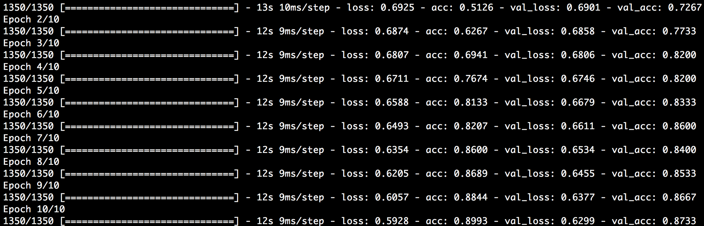

### Grupo: Gonzalo Zigarán, Mauricio Clerici y Pedro Pérez

## Aprendizaje Profundo

# Práctico I

## Ejercicio 1

### Introducción

Se trabajó con datos de **movie reviews** obtenidos durante la materia
*Aprendizaje Supervisado*. Se copió el dataset y se escribió un script en Python
para clasificar en **Positiva** o **Negativa** cada una de las opiniones de los
usuarios.

Se utilizó TfIDF para obtener una representación de cada review y el paquete
Keras para crear los datos de validación.

Se entrenaron modelos variando parámetros como:

* Número de capas ocultas,
* Razón de Dropout para cada capa,
* Número de instancias en cada batch, y
* Número de épocas.

Al variar los datos se evaluó la performance de cada modelo y se seleccionaron
los que se consideraron mejores teniendo en cuenta evitar el overfitting.

El tamaño del vocabulario es de 35090 sobre 1500 reviews palabras y en el vectorizador del TfIDF se
dejaron los parámetros por default salvo las *stop words* que se utilizaron las
del inglés.

### Procesamiento

#### Script

El script realizado permite definir parámetros de la siguiente forma:

```bash
python exercise_1.py --num_units <N M ...> --dropout <Nd Md ...> --batch_size <B> --epochs <E>
```

donde:

* `<N M ...>` son números enteros que indican el número de unidades ocultas en
cada capa oculta,
* `<Nd Md ...>` son números enteros que indican la razón de Dropout para la
correspondiente capa oculta,
* `<B>` es un número entero que indica el número de batches, y
* `<E>` es un número entero que indica el número de épocas.

#### Entrenamiento

Se utilizó sklearn para división del dataset entre un conjunto de *test* (0.25) y un
conjunto de *train*, y para vectorizar por medio de la función
`TfidfVectorizer()`.

Se utilizó Keras para convertir los datos en categóricos y su función `Sequential()` para
construir el modelo.

Se utilizaron dos tamaños de validation test en el model fit (0.1 y 0.2) para
evaluar diferencias, ganando datos de entrenamiento en un caso, donde se
perdieron datos de validación en el entrenamiento. Se corrieron entrenamientos
con los mismos parámetros para cada uno de estos dos casos.

Al encontrar los mejores parámetros, se corrieron 10 nuevos entrenamientos con esta
configuración y mayor número de épocas (10) a los fines de evaluar su
estabilidad/fluctuación.

### Resultados

Duespués de algunos experimentos como se muestran en imagen:


Se encontró que la mejor configuración de parámetros correspondía a 2 capas
ocultas de 100 y 50 unidades respectivamente, con valores de 0.7 y 0.5 de
Dropout y un validation test de 0.1. No se varió el número de batches (32) y el número de épocas quedó fijo
en 5.

Una vez obtenido ese resultado, considerando que no incurría en overfitting
(controlado por medio del accuracy en cada época en el conjunto de
 entrenamiento, ver figura), se realizaron nuevos experimentos, con la misma configuración y aumentando el
número de épocas a 10.



En este caso, el experimento se repitió 10 veces.


Se encontró que esta configuración otorga un accuracy de medio de 0.798 con una
desviación estándar de 0.021, por lo que se la consideró además aceptablemente
estable.