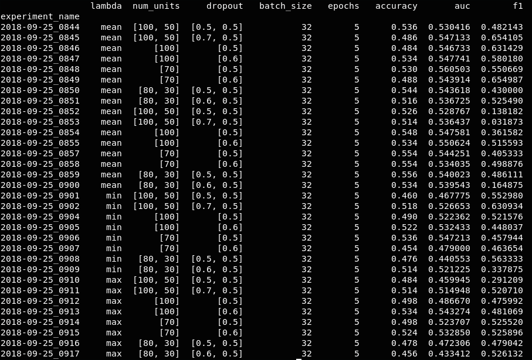

### Grupo: Gonzalo Zigarán, Mauricio Clerici y Pedro Pérez

## Aprendizaje Profundo

# Práctico I

## Ejercicio 2

### Introducción

Se trabajó con datos de **movie reviews** obtenidos durante la materia
*Aprendizaje Supervisado*. Se copió el dataset y se escribió un script en Python
para clasificar en **Positiva** o **Negativa** cada una de las opiniones de los
usuarios.

Como en el ejercicio 11, se plantea realizar la clasificación a partir de una red 
neuronal, con la diferencia de que en este ejercicio se cambia el preprocesamiento
de los textos.

En vez de utilizar TfIDF para obtener una representación de cada review, se plantea 
una representación basada en embeddings de cada palabra. Para esto se utilizó el 
wordvector de FastText.

Con el script `filter_fasttext.py` generamos un objeto con el vocabulario, sus pesos 
y vectores correspondientes. 

Para generar este vocabulario se utiliza el embedding ya entrenado `crawl-300d-2M.vec.zip`, que cuenta con 2 millones de *wordvectors* entrenados en [Common Crawl](http://commoncrawl.org/).

Una vez obtenida la representación de cada review, se entrenaron modelos variando 
parámetros como:

* Número de capas ocultas,
* Razón de Dropout para cada capa,
* Número de instancias en cada batch, y
* Número de épocas.

Al variar los datos se evaluó la performance de cada modelo y se seleccionaron
los que se consideraron mejores teniendo en cuenta evitar el overfitting.

El tamaño del vocabulario es de 50920 sobre 1500 reviews, a cada palabra se lo 
asocia con un vector de 300 dimensiones. 

### Procesamiento

#### Script

El script realizado permite definir parámetros de la siguiente forma:

```bash
python exercise_2.py --num_units <N M ...> --dropout <Nd Md ...> --batch_size <B> --epochs <E>
```

donde:

* `<N M ...>` son números enteros que indican el número de unidades ocultas en
cada capa oculta,
* `<Nd Md ...>` son números enteros que indican la razón de Dropout para la
correspondiente capa oculta,
* `<B>` es un número entero que indica el número de batches, y
* `<E>` es un número entero que indica el número de épocas.

#### Entrenamiento

Se utilizó sklearn para división del dataset entre un conjunto de *test* (0.25) y un
conjunto de *train*, y para vectorizar por medio de un embedding ya entrenado `crawl-300d-2M.vec`.

Se utilizó Keras para convertir los datos en categóricos y su función `Sequential()` para
construir el modelo.

En primera instancia, se crea una capa `Embedding`, para transformar el review en un formato que pueda procesar la red con los pesos obtenidos por el embedding ya entrenado. Luego pasa por una capa `Lambda` para generar un único vector a partir de todos los vectores de las palabras del review. En este ejercicio hemos utilizado 3 funciónes para lograr esto:

* El vector medio de todos los vectores de las palabras
* El mínimo coordenada a coordenada de los vectores
* El máximo coordenada a coordenada de los vectores

Luego se trabajó con capas densas, definidas por los datos de entrada.

Se utilizaron dos tamaños de validation test en el model fit (0.1 y 0.2) para
evaluar diferencias, ganando datos de entrenamiento en un caso, donde se
perdieron datos de validación en el entrenamiento. Se corrieron entrenamientos
con los mismos parámetros para cada uno de estos dos casos.

Al encontrar los mejores parámetros, se corrieron 10 nuevos entrenamientos con esta
configuración y mayor número de épocas (10) a los fines de evaluar su
estabilidad/fluctuación.

### Resultados

Duespués de algunos experimentos como se muestran en imagen:




Con los experimentos realizados con el promedio como función para agrupar los vectores 
de las palabras, observamos que no hay grandes diferencias entre considerar una 
proporcion de 0.1 de validación (los primeraos experimentos con función `mean`) y 
considerar 0.2 de validación (los últimos experimentos con lambda `mean`). Por lo que 
para las pruebas siguientes dejamos fijo la validación en 0.2.

Podemos ver en todos los experimentos que no se obtienen resultados interesantes, para 
todas las métricas observamos una peor performance que en el ejercicio anterior, por lo que 
no ganamos nada con los word embeddings con éstas consideraciones. 

Todos los experimentos tienen una `accuracy` al rededor de 0.5 que es lo esperable para un
modelo aleatoreo, por lo que no se puede considerar que el modelo esté realizando algún 
aprendizaje. Al notar este comportamiento similar para todos los parámetros, podemos concluir 
que el embedding no está bien planteado, por lo que los vectores y pesos para las palabras 
del vocabulario, hacen que se pierda mucha información. 
